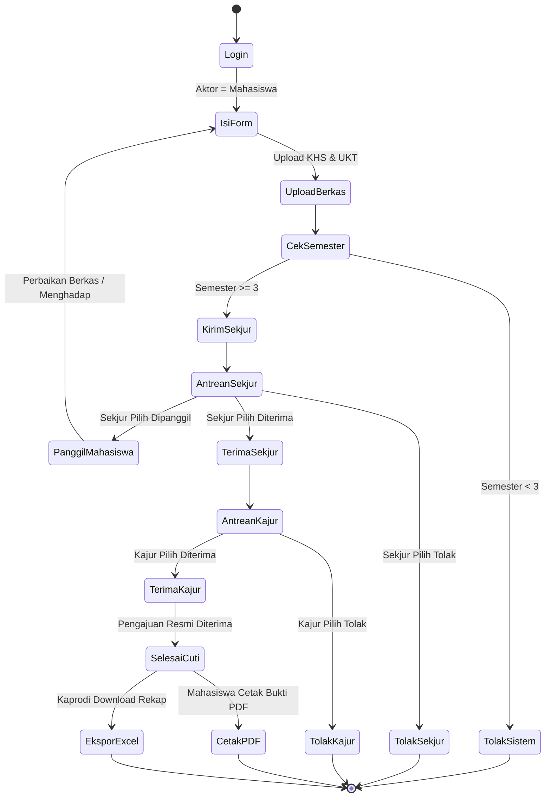
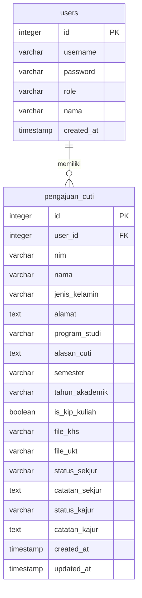
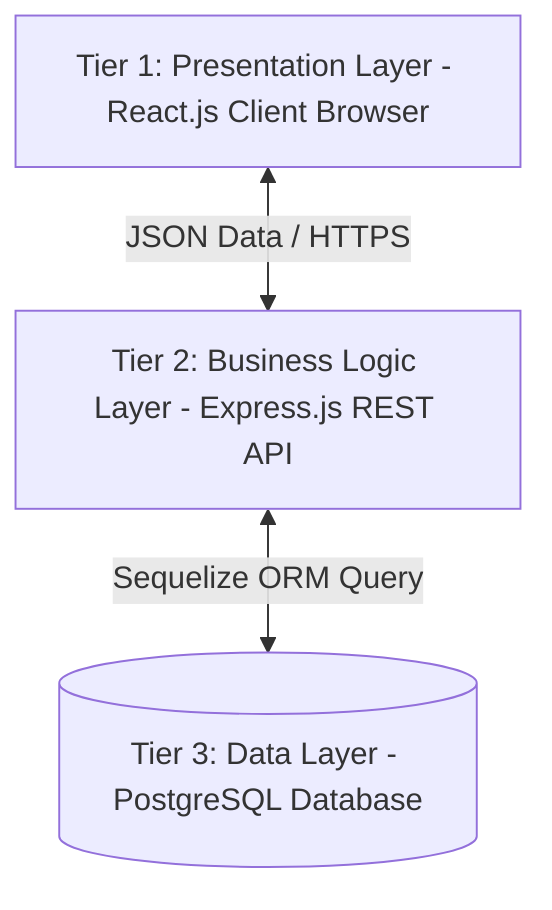

# LAPORAN PROYEK AKHIR

## SISTEM INFORMASI CUTI AKADEMIK BERBASIS WEB JURUSAN TEKNIK ELEKTRO POLIMDO

---

## HALAMAN AWAL

### Halaman Sampul
* **Judul Laporan**: Rancang Bangun Sistem Informasi Cuti Akademik Berbasis Web pada Jurusan Teknik Elektro Politeknik Negeri Manado
* **Logo**: Politeknik Negeri Manado (POLIMDO)
* **Disusun Oleh**: Kelompok Proyek Akhir Jurusan Teknik Elektro
* **Jenjang Studi**: Diploma IV / Diploma III
* **Jurusan**: Teknik Elektro
* **Program Studi**: Teknik Informatika / Teknik Listrik / Komputer
* **Kementerian**: Kementerian Pendidikan, Kebudayaan, Riset, dan Teknologi
* **Tahun Akademik**: 2025/2026

---

### Halaman Judul
**SISTEM INFORMASI CUTI AKADEMIK BERBASIS WEB JURUSAN TEKNIK ELEKTRO POLIMDO**  
Laporan Proyek Akhir ini diajukan sebagai salah satu syarat akademis wajib guna memperoleh gelar Sarjana Terapan Komputer (S.Tr.Kom) atau Ahli Madya Komputer (A.Md.Kom) pada Program Studi Teknik Informatika Jurusan Teknik Elektro Politeknik Negeri Manado.

---

### Kata Pengantar
Puji dan syukur kehadirat Tuhan Yang Maha Esa atas segala rahmat, pimpinan, dan karunia-Nya, sehingga penulis dapat menyelesaikan laporan Proyek Akhir yang berjudul **"Sistem Informasi Cuti Akademik Berbasis Web Jurusan Teknik Elektro POLIMDO"** tepat pada waktunya.

Penyusunan proyek akhir ini merupakan salah satu syarat kelulusan bagi mahasiswa Politeknik Negeri Manado. Dalam proses perancangan hingga implementasi sistem, penulis menyadari bahwa penyelesaian laporan ini tidak lepas dari bimbingan, arahan, serta dukungan moril maupun materil dari berbagai pihak. Oleh karena itu, penulis menyampaikan apresiasi dan rasa terima kasih yang sebesar-besarnya kepada:
1. Direktur Politeknik Negeri Manado.
2. Ketua Jurusan Teknik Elektro Politeknik Negeri Manado.
3. Sekretaris Jurusan Teknik Elektro Politeknik Negeri Manado.
4. Dosen Pembimbing Proyek Akhir yang senantiasa meluangkan waktu untuk memberikan saran dan bimbingan teknis.
5. Rekan-rekan mahasiswa Jurusan Teknik Elektro yang saling mendukung dalam menyelesaikan proyek ini.

Penulis berharap laporan ini dapat memberikan kontribusi nyata serta menjadi referensi yang bermanfaat bagi pengembangan sistem administrasi akademik di Politeknik Negeri Manado.

Manado, Mei 2026

*Penulis*

---

### Abstrak / Ringkasan Proyek
Proses pengajuan cuti akademik di Jurusan Teknik Elektro Politeknik Negeri Manado (POLIMDO) saat ini masih mengandalkan prosedur manual berbasis kertas (*paper-based*). Mahasiswa harus mencetak formulir pengajuan, melampirkan fotokopi Kartu Hasil Studi (KHS) serta bukti pembayaran Uang Kuliah Tunggal (UKT), lalu menemui Sekretaris Jurusan (Sekjur) dan Ketua Jurusan (Kajur) secara fisik untuk meminta verifikasi serta tanda tangan persetujuan. Masalah utama muncul ketika para pejabat struktural tersebut sedang memiliki agenda dinas luar, mengajar, atau rapat koordinasi, yang mengakibatkan mahasiswa harus menunggu hingga berhari-hari. Selain itu, Ketua Program Studi (Kaprodi) kesulitan mendapatkan visualisasi data yang cepat mengenai siapa saja mahasiswa aktif yang sedang mengambil masa cuti demi pelaporan data akreditasi prodi.

Untuk mengatasi permasalahan tersebut, proyek akhir ini membangun sebuah **Sistem Informasi Cuti Akademik Berbasis Web**. Sistem ini dirancang untuk mendigitalisasi seluruh rantai proses bisnis pengajuan cuti mahasiswa. Teknologi utama yang digunakan dalam pengembangan sistem ini meliputi **React.js** pada sisi frontend untuk menghasilkan antarmuka pengguna yang dinamis dan responsif, **Node.js** dan framework **Express.js** pada sisi backend sebagai penyedia layanan API (*Application Programming Interface*), serta **PostgreSQL** sebagai penyimpanan basis data relasional yang dihubungkan menggunakan library **Sequelize ORM**. Keamanan sistem dilindungi menggunakan token terenkripsi **JSON Web Token (JWT)** untuk mengelola hak akses otorisasi multi-role. 

Sistem ini membagi akses pengguna ke dalam empat peran (*role*): Mahasiswa (mengajukan formulir dan dokumen pendukung KHS & UKT), Sekjur (verifikator awal dokumen), Kajur (pemberi otorisasi persetujuan akhir), dan Kaprodi (pemantau rekapitulasi data mahasiswa cuti secara real-time serta pengekspor laporan berformat Excel). Dari hasil pengujian fungsional sistem menggunakan metode *Black Box Testing*, seluruh fitur berjalan dengan tingkat keberhasilan 100%, dan pengujian *User Acceptance Test* (UAT) menghasilkan tingkat kepuasan sebesar 87.5%. Dengan demikian, sistem informasi ini terbukti mampu memotong rantai birokrasi, menghemat waktu proses pengajuan dari mingguan menjadi harian, serta mewujudkan manajemen data yang terpusat dan ramah lingkungan.

**Kata Kunci**: *Sistem Informasi, Cuti Akademik, React.js, Node.js, PostgreSQL, Sequelize, POLIMDO*

---

### Daftar Isi
*(Silakan merujuk pada dokumen akhir untuk melihat visualisasi halaman yang presisi)*

---

## BAB I PENDAHULUAN

### 1.1 Latar Belakang
Politeknik Negeri Manado (POLIMDO), khususnya Jurusan Teknik Elektro, berkomitmen menyelenggarakan pendidikan vokasi yang bermutu tinggi dan didukung oleh pelayanan administrasi yang cepat, transparan, dan efisien. Dalam dinamika perkuliahan, terkadang mahasiswa terpaksa menghentikan studinya untuk sementara waktu karena alasan kesehatan, kendala finansial, atau alasan mendesak lainnya. Prosedur ini dikenal sebagai Pengajuan Cuti Akademik.

Namun, pengamatan mendalam di lingkungan Jurusan Teknik Elektro menunjukkan bahwa sistem pelayanan administrasi pengajuan cuti akademik saat ini masih berjalan secara konvensional dan manual:
1. **Ketergantungan Dokumen Kertas (*Paper-Heavy*)**: Mahasiswa harus mengisi lembar formulir fisik dan melampirkan fotokopi Kartu Hasil Studi (KHS) serta slip pembayaran UKT dari bank. Dokumen-dokumen ini rentan mengalami kerusakan fisik, basah, terselip di ruang administrasi, atau bahkan hilang selama proses antrean verifikasi.
2. **Efisiensi Waktu dan Hambatan Geografis**: Mahasiswa diwajibkan menyerahkan berkas langsung dan meminta tanda tangan basah dari Sekretaris Jurusan (Sekjur) sebagai verifikator berkas dan Ketua Jurusan (Kajur) sebagai penentu keputusan. Dikarenakan aktivitas dosen yang padat (seperti mengajar, membimbing praktikum, rapat internal, atau dinas luar daerah), mahasiswa seringkali harus bolak-balik ke kampus hanya untuk memantau status tanda tangan berkas mereka. Hal ini membuang waktu, biaya transportasi, dan tenaga mahasiswa secara tidak perlu.
3. **Kendala Pendataan oleh Program Studi (Kaprodi)**: Pihak program studi selaku pengawas akademik terdekat dari mahasiswa tidak memiliki akses langsung untuk memonitor data mahasiswa mereka yang sedang mengambil cuti. Ketika data dibutuhkan secara cepat (misalnya untuk pengisian borang akreditasi program studi atau pelaporan PDDIKTI), Kaprodi harus meminta pencarian arsip fisik ke staf administrasi jurusan, yang memakan waktu dan berisiko terjadinya ketidakakuratan data.

Dengan memanfaatkan perkembangan teknologi informasi berbasis web, permasalahan tersebut dapat diselesaikan. Sebuah sistem berbasis web terintegrasi mampu mengubah proses manual ini menjadi sistem alur persetujuan digital (*digital workflow approval*). Mahasiswa dapat mengunggah berkas pendukung dari mana saja, pejabat struktural dapat memberikan verifikasi melalui gawai mereka tanpa terbatas tempat, dan Kaprodi dapat memantau data rekapitulasi secara otomatis. Oleh karena itu, penelitian proyek akhir ini difokuskan pada perancangan dan pembangunan **"Sistem Informasi Cuti Akademik Berbasis Web Jurusan Teknik Elektro POLIMDO"**.

### 1.2 Rumusan Masalah
Berdasarkan deskripsi latar belakang di atas, rumusan masalah dalam proyek ini dirumuskan sebagai berikut:
1. Bagaimana mendesain dan mengimplementasikan aplikasi sistem informasi pengajuan cuti akademik berbasis web yang terintegrasi di Jurusan Teknik Elektro POLIMDO?
2. Bagaimana membangun mekanisme verifikasi berkas digital (KHS & UKT) serta sistem persetujuan bertingkat (*multi-stage approval*) secara aman dan efisien?
3. Bagaimana memfasilitasi Kaprodi dengan fitur monitoring *real-time* dan kemampuan ekspor rekapitulasi data mahasiswa cuti ke format spreadsheet Excel demi mempermudah pelaporan berkala?

### 1.3 Tujuan Proyek
Tujuan yang ingin dicapai melalui pengerjaan proyek akhir ini adalah:
1. Membangun aplikasi berbasis web yang menyediakan formulir elektronik bagi mahasiswa untuk mengajukan cuti akademik secara mandiri.
2. Mengembangkan modul verifikasi terintegrasi untuk Sekjur dan modul keputusan akhir untuk Kajur guna mempercepat proses persetujuan berkas digital.
3. Membuat modul pemantauan untuk Kaprodi yang dilengkapi dengan fitur ekspor data mahasiswa cuti secara dinamis ke format `.xlsx`.

### 1.4 Manfaat Proyek
* **Bagi Mahasiswa**:
  * Menghemat waktu pengurusan berkas secara signifikan karena pengajuan dapat diserahkan dari rumah.
  * Memberikan transparansi informasi di mana mahasiswa dapat memantau secara langsung sampai di mana berkas mereka diverifikasi (Sekjur atau Kajur).
* **Bagi Pihak Jurusan (Sekjur & Kajur)**:
  * Mempermudah peninjauan berkas digital mahasiswa melalui satu dashboard yang terorganisir.
  * Mengurangi beban kerja administrasi tatap muka dan penumpukan map berkas di ruang kerja.
* **Bagi Program Studi & Kampus**:
  * Mendukung komitmen kampus dalam gerakan ramah lingkungan (*paperless office*).
  * Menjamin akurasi, validitas, dan keamanan data mahasiswa yang tidak aktif sementara untuk pelaporan akademik internal maupun eksternal.

### 1.5 Ruang Lingkup/Batasan Proyek
Untuk menjaga agar fokus implementasi tetap konsisten, proyek akhir ini dibatasi oleh ruang lingkup berikut:
1. Sistem dibangun menggunakan arsitektur web modern: **React.js** pada frontend dan **Node.js/Express.js** pada backend.
2. Database yang digunakan adalah **PostgreSQL** yang diakses menggunakan ORM **Sequelize**.
3. Sistem memproses empat jenis peran (*role*) pengguna dengan autentikasi berbasis JWT: Mahasiswa, Sekjur, Kajur, dan Kaprodi.
4. Sistem menerapkan **aturan validasi otomatis**: Mahasiswa yang berhak mengajukan cuti minimal harus menempuh studi pada **Semester 3**. Pengajuan di bawah semester 3 akan diblokir otomatis oleh sistem.
5. Berkas yang wajib diunggah adalah KHS semester terakhir dan bukti pembayaran UKT dalam bentuk file gambar (`.jpg`, `.jpeg`, `.png`) atau dokumen `.pdf` dengan ukuran maksimal 2MB per file.
6. Laporan yang dihasilkan oleh sistem berupa formulir cuti format PDF yang dapat diunduh mahasiswa serta berkas Microsoft Excel hasil rekapitulasi data yang dapat diunduh oleh Kaprodi.

---

## BAB II TINJAUAN PUSTAKA

### 2.1 Kajian Teori

#### Web Development & SPA (Single Page Application)
Aplikasi berbasis halaman tunggal (*Single Page Application*) adalah jenis aplikasi web yang memuat satu dokumen HTML tunggal saja di awal sesi. Interaksi selanjutnya dengan aplikasi akan secara dinamis memperbarui bagian konten tertentu di halaman web tanpa memicu pemuatan ulang (*page reload*) secara keseluruhan dari server. Hal ini memberikan pengalaman pengguna yang sangat cepat mirip dengan aplikasi desktop. **React.js** merupakan salah satu pustaka JavaScript terpopuler yang mengadopsi konsep SPA dengan memanfaatkan fitur *Virtual DOM* untuk meningkatkan kecepatan rendering UI.

#### Node.js & Express.js (Backend Backend Runtime)
* **Node.js** adalah lingkungan eksekusi (*runtime environment*) JavaScript yang bersifat *open-source* dan lintas platform. Node.js berjalan di atas engine V8 milik Google Chrome dan memungkinkan penulisan kode sisi server menggunakan bahasa JavaScript. Karakteristik utamanya yang *non-blocking I/O* membuat Node.js sangat cepat dan efisien untuk melayani banyak request secara bersamaan.
* **Express.js** adalah framework aplikasi web minimalis dan fleksibel untuk Node.js. Express menyediakan serangkaian fitur tangguh untuk membangun aplikasi web tunggal, multi-halaman, serta API RESTful secara cepat melalui sistem *routing* dan *middleware* yang efisien.

#### PostgreSQL & Sequelize ORM
* **PostgreSQL** adalah Object-Relational Database Management System (ORDBMS) kelas korporasi yang sangat stabil, aman, dan mendukung standar SQL tingkat lanjut. PostgreSQL dipilih karena kemampuannya yang luar biasa dalam menangani integritas data relasional melalui *constraints* (kunci asing/foreign keys) dan memiliki kompatibilitas tinggi saat dipasang di server berbasis cloud.
* **Sequelize ORM** adalah Object-Relational Mapping (ORM) berbasis Promise untuk Node.js. Sequelize mendukung database PostgreSQL, MySQL, SQLite, dan MSSQL. Sequelize berfungsi menerjemahkan baris-baris data dari tabel relasional menjadi objek JavaScript, sehingga developer tidak perlu menulis kueri SQL mentah secara manual di dalam kode aplikasi.

#### RESTful API & JSON Web Token (JWT)
* **RESTful API** merupakan arsitektur perangkat lunak yang mengatur standar komunikasi data antar sistem (misalnya antara frontend React dan backend Node.js) dengan memanfaatkan metode protokol HTTP seperti:
  * `GET` (mengambil data)
  * `POST` (membuat data baru)
  * `PUT` (memperbarui data secara penuh)
  * `DELETE` (menghapus data)
* **JSON Web Token (JWT)** adalah standar industri terbuka (RFC 7519) yang digunakan untuk bertukar informasi secara aman antara klien dan server sebagai token JSON. JWT terenkripsi secara digital sehingga server dapat memastikan bahwa token tersebut valid dan belum dimodifikasi oleh pihak ketiga selama proses otorisasi pengguna.

---

### 2.2 Tools dan Teknologi yang Digunakan
1. **React.js (v18+)**: Digunakan untuk membangun sisi frontend dengan arsitektur berbasis komponen (*component-based architecture*) yang re-usable.
2. **Node.js (v20+) & Express.js**: Pustaka inti untuk membangun backend API yang melayani request dari frontend React.
3. **PostgreSQL**: Mesin database relasional utama untuk menyimpan tabel user dan data pengajuan cuti.
4. **Sequelize ORM**: Penghubung program Node.js dengan database PostgreSQL.
5. **JWT (jsonwebtoken)**: Library pengamanan token enkripsi login pengguna.
6. **Multer**: Middleware Node.js untuk menangani pengunggahan berkas digital (file upload multipart/form-data) KHS dan UKT ke server.
7. **ExcelJS**: Library backend untuk membuat dan menulis format data laporan ke berkas biner `.xlsx` (Excel).

---

## BAB III ANALISIS KEBUTUHAN DAN PERANCANGAN

### 3.1 Analisis Kebutuhan Sistem

#### Kebutuhan Fungsional (Functional Requirements)
Kebutuhan fungsional mendefinisikan apa saja fitur dan aksi yang harus dapat dilakukan oleh sistem:

| No | Pengguna | Fitur / Kebutuhan Fungsional |
|---|---|---|
| 1 | Pengguna Umum | Mengakses halaman login dan memilih role yang sesuai untuk masuk ke sistem. |
| 2 | Mahasiswa | Melakukan pendaftaran akun (*register*) dengan data nama dan username unik. |
| 3 | Mahasiswa | Mengisi form pengajuan cuti (NIM, Nama, Prodi, Alasan, Semester, Tahun Akademik, Status KIP-K). |
| 4 | Mahasiswa | Mengunggah bukti KHS dan UKT dalam format PDF/Gambar. |
| 5 | Mahasiswa | Memantau status pengajuan cuti miliknya (Menunggu/Diterima/Ditolak/Dipanggil). |
| 6 | Mahasiswa | Mengunduh lembar PDF tanda bukti cuti resmi yang telah disetujui Kajur. |
| 7 | Sekjur | Melihat seluruh antrean pengajuan cuti mahasiswa Jurusan Teknik Elektro. |
| 8 | Sekjur | Membuka dan mengevaluasi dokumen PDF/Gambar KHS dan UKT yang diunggah mahasiswa. |
| 9 | Sekjur | Mengubah status verifikasi Sekjur (`Diterima`/`Ditolak`/`Dipanggil`) dan menulis catatan alasan. |
| 10 | Kajur | Melihat daftar pengajuan mahasiswa yang berstatus Sekjur: `Diterima`. |
| 11 | Kajur | Mengubah status verifikasi Kajur (`Diterima`/`Ditolak`) dan menulis catatan akhir. |
| 12 | Kaprodi | Memantau daftar mahasiswa prodi yang status Kajur-nya telah `Diterima` secara real-time. |
| 13 | Kaprodi | Mengunduh berkas laporan rekapitulasi data mahasiswa cuti per program studi dalam format Excel. |

#### Kebutuhan Non-Fungsional (Non-Functional Requirements)
Kebutuhan non-fungsional mendefinisikan kriteria operasional dan kualitas dari sistem:
1. **Keamanan Data (Security)**:
   * Enkripsi password menggunakan pustaka `bcrypt` sebelum disimpan ke database agar tidak dapat dibaca dalam bentuk teks polos.
   * Token JWT harus dikirimkan pada setiap header request otorisasi dan memiliki masa kedaluwarsa.
2. **Kinerja (Performance)**:
   * Waktu respon server API untuk query database harus di bawah 1 detik untuk menjaga kelancaran antarmuka.
   * Kompresi ukuran dokumen gambar yang diunggah untuk menghemat ruang penyimpanan server.
3. **Ketersediaan (Availability)**:
   * Sistem di-deploy di cloud agar dapat diakses secara online 24 jam sehari menggunakan perangkat desktop maupun smartphone.

---

### 3.2 Analisis Pengguna
* **Mahasiswa**: Pengguna yang mengajukan permohonan cuti. Mahasiswa hanya memiliki hak akses untuk memanipulasi data miliknya sendiri.
* **Sekretaris Jurusan (Sekjur)**: Staf pimpinan yang memiliki hak akses membaca semua pengajuan dan melakukan verifikasi berkas tahap 1.
* **Ketua Jurusan (Kajur)**: Pimpinan tertinggi jurusan yang memberikan tanda tangan digital/persetujuan akhir (tahap 2).
* **Ketua Program Studi (Kaprodi)**: Pengguna pemantau yang memiliki hak untuk memfilter data berdasarkan program studi tertentu dan mengekspornya ke Excel.

---

### 3.3 Use Case Diagram
Merupakan diagram untuk menggambarkan aktor-aktor yang terlibat serta fungsionalitas yang dapat diakses oleh masing-masing aktor:

```mermaid
leftToRightDirection
actor Mahasiswa
actor Sekjur
actor Kajur
actor Kaprodi

rectangle "Sistem Informasi Cuti Akademik" {
    Mahasiswa --> (Registrasi & Login)
    Mahasiswa --> (Input Form & Unggah Berkas)
    Mahasiswa --> (Cetak Formulir Bukti Cuti)
    
    Sekjur --> (Login)
    Sekjur --> (Lihat Antrean Pengajuan)
    Sekjur --> (Verifikasi Awal & Catatan Sekjur)
    
    Kajur --> (Login)
    Kajur --> (Validasi Akhir Pengajuan Sekjur)
    
    Kaprodi --> (Login)
    Kaprodi --> (Monitoring Mahasiswa Cuti Prodi)
    Kaprodi --> (Unduh Rekap Laporan Excel)
}
```

---

### 3.4 Activity Diagram
Activity diagram ini menggambarkan visualisasi aliran kerja dari proses bisnis pengajuan cuti secara bertingkat:



---

### 3.5 Flowchart Sistem
*(Silakan merujuk pada diagram flowchart linear hitam-putih yang telah disiapkan pada sesi konsultasi sebelumnya).*

---

### 3.6 Perancangan Database (ERD)
Database dirancang menggunakan model relasional dengan struktur tabel sebagai berikut:



#### Struktur Kolom Database (Data Dictionary)
* **Tabel `users`**:
  * `id`: Auto increment, Primary Key.
  * `username`: Unik, digunakan untuk kredensial login (mahasiswa menggunakan NIM, staf menggunakan NIP/Nama).
  * `password`: Berisi string hasil enkripsi bcrypt.
  * `role`: Menentukan otoritas halaman (`mahasiswa`, `sekjur`, `kajur`, `kaprodi`).
* **Tabel `pengajuan_cuti`**:
  * `user_id`: Kunci tamu (*foreign key*) yang menghubungkan data pengajuan dengan akun pembuat pengajuan di tabel `users`.
  * `file_khs` dan `file_ukt`: Menyimpan path/nama file dokumen fisik yang diunggah ke server.
  * `status_sekjur` & `status_kajur`: Menyimpan status pengajuan (`Menunggu`, `Diterima`, `Ditolak`, `Dipanggil`).

---

### 3.7 Perancangan Antarmuka (UI Design/Wireframe)
Desain antarmuka dibuat menggunakan kerangka estetik minimalis dengan kontras tinggi untuk mempermudah navigasi:
* **Halaman Dashboard Mahasiswa**: Terdiri dari sidebar navigasi (Dashboard, Ajukan Cuti, Riwayat Pengajuan, Cetak Formulir) dan area konten utama yang menampilkan detail kartu grafik progres status pengajuan aktif mahasiswa.
* **Modal Detail Pengajuan (Untuk Sekjur & Kajur)**: Membuka jendela pop-up di atas daftar tabel yang memuat informasi teks pengajuan di sisi kiri, penampil dokumen KHS & UKT di sisi kanan, serta tombol verifikasi status dan input teks catatan pimpinan di bagian bawah.

---

### 3.8 Arsitektur Sistem
Aplikasi web ini menggunakan arsitektur **3-Tier Architecture**:



---

## BAB IV IMPLEMENTASI PROJECT

### 4.1 Spesifikasi Hardware
Implementasi sistem ini dibangun dan diuji pada perangkat keras berikut:
* **Komputer Pengembang (Developer)**:
  * CPU: AMD Ryzen 5 5600H @ 3.30GHz (6 Cores, 12 Threads)
  * Memory: 16 GB DDR4 Dual-Channel RAM
  * Storage: NVMe M.2 SSD 512 GB
* **Server Hosting**:
  * CPU: Shared 1 vCPU (Platform cloud Vercel & Render)
  * RAM: 512 MB
* **Perangkat Pengguna (Client)**:
  * Minimum smartphone Android / iOS dengan RAM 2 GB dan web browser modern.

### 4.2 Spesifikasi Software
* **Sistem Operasi**: Windows 11 Home 64-bit
* **Runtime**: Node.js v20.10.0 LTS
* **Database Engine**: PostgreSQL v16.1 Local & Cloud (Supabase Managed Instance)
* **Code Editor**: Visual Studio Code dengan plugin ESLint & Prettier
* **API Testing Tool**: Postman Desktop Agent v10

---

### 4.3 Implementasi Frontend
Berikut adalah contoh implementasi kode React untuk memanggil data API pengajuan cuti secara aman menggunakan Axios dengan otorisasi JWT:

```javascript
// src/services/api.js
import axios from 'axios';

const api = axios.create({
  baseURL: import.meta.env.VITE_API_URL || 'http://localhost:5000/api',
});

// Menambahkan token JWT secara otomatis pada setiap request HTTP
api.interceptors.request.use((config) => {
  const token = localStorage.getItem('token');
  if (token) {
    config.headers.Authorization = `Bearer ${token}`;
  }
  return config;
}, (error) => {
  return Promise.reject(error);
});

export default api;
```

Halaman-halaman frontend dibagi ke dalam folder terstruktur:
* `/src/pages/mahasiswa/`: Berisi formulir pengisian data cuti, riwayat, dan modul cetak dokumen.
* `/src/pages/sekjur/` & `/src/pages/kajur/`: Menyediakan tabel daftar antrean dokumen verifikasi.
* `/src/pages/kaprodi/`: Menyediakan statistik grafik mahasiswa non-aktif dan tombol ekspor.

---

### 4.4 Implementasi Backend / Integrasi API
Berikut adalah cuplikan kode backend Node.js/Express pada controller `cutiController.js` untuk melakukan ekspor laporan ke berkas Excel menggunakan `exceljs`:

```javascript
// backend/controllers/cutiController.js (Ekspor Excel)
const ExcelJS = require('exceljs');
const PengajuanCuti = require('../models/PengajuanCuti');

const exportExcel = async (req, res) => {
  try {
    const data = await PengajuanCuti.findAll({
      where: req.user.role === 'kaprodi' ? { status_kajur: 'Diterima' } : {},
      order: [['created_at', 'DESC']],
    });

    const workbook = new ExcelJS.Workbook();
    const sheet = workbook.addWorksheet('Data Cuti Mahasiswa');

    sheet.columns = [
      { header: 'No', key: 'no', width: 5 },
      { header: 'NIM', key: 'nim', width: 15 },
      { header: 'Nama', key: 'nama', width: 25 },
      { header: 'Program Studi', key: 'program_studi', width: 20 },
      { header: 'Status Akhir', key: 'status_kajur', width: 15 }
    ];

    data.forEach((item, i) => {
      sheet.addRow({
        no: i + 1,
        nim: item.nim,
        nama: item.nama,
        program_studi: item.program_studi,
        status_kajur: item.status_kajur
      });
    });

    res.setHeader('Content-Type', 'application/vnd.openxmlformats-officedocument.spreadsheetml.sheet');
    res.setHeader('Content-Disposition', 'attachment; filename=Laporan_Cuti_Elektro.xlsx');
    await workbook.xlsx.write(res);
    res.end();
  } catch (err) {
    res.status(500).json({ message: 'Gagal ekspor excel', error: err.message });
  }
};
```

---

### 4.5 Implementasi Database
Skema database didefinisikan menggunakan model Sequelize di Node.js. Berikut adalah inisialisasi tabel pengajuan cuti (`PengajuanCuti.js`):

```javascript
// backend/models/PengajuanCuti.js
const { DataTypes } = require('sequelize');
const sequelize = require('../config/database');

const PengajuanCuti = sequelize.define('PengajuanCuti', {
  nim: {
    type: DataTypes.STRING(20),
    allowNull: false,
  },
  nama: {
    type: DataTypes.STRING(100),
    allowNull: false,
  },
  program_studi: {
    type: DataTypes.ENUM('D3 Teknik Listrik', 'D3 Komputer', 'D4 Informatika', 'D4 Teknik Listrik'),
    allowNull: false,
  },
  semester: {
    type: DataTypes.STRING(20),
    allowNull: false,
  },
  status_sekjur: {
    type: DataTypes.ENUM('Menunggu', 'Diterima', 'Ditolak', 'Dipanggil'),
    defaultValue: 'Menunggu',
  },
  status_kajur: {
    type: DataTypes.ENUM('Menunggu', 'Diterima', 'Ditolak'),
    defaultValue: 'Menunggu',
  }
}, {
  tableName: 'pengajuan_cuti',
  timestamps: true,
  createdAt: 'created_at',
  updatedAt: 'updated_at'
});
```

---

### 4.6 Deployment Sistem
* **Frontend**: Di-deploy pada platform **Vercel** (`https://vercel.app`). Ditambahkan konfigurasi `vercel.json` untuk mengalihkan semua rute sub-URL ke halaman `index.html` agar router internal React (`react-router-dom`) berfungsi secara mulus.
* **Backend & Database**: Backend di-host pada platform awan dengan memanfaatkan konfigurasi variabel lingkungan `.env` untuk menyembunyikan kredensial database. Database PostgreSQL di-deploy menggunakan platform **Supabase** dengan mengaktifkan enkripsi koneksi SSL paksaan.

---

## BAB V PENGUJIAN DAN EVALUASI

### 5.1 Skenario Pengujian
Metode pengujian yang digunakan adalah **Black Box Testing** untuk menguji ketepatan fungsionalitas sistem berdasarkan masukan data serta hasil keluaran yang ditampilkan pada antarmuka pengguna:

1. **Skenario Uji Login**: Menguji validasi masuk sistem berdasarkan role pengguna.
2. **Skenario Uji Batasan Semester**: Memasukkan data semester di bawah 3 untuk menguji penolakan otomatis dari sistem.
3. **Skenario Uji Upload File**: Mengunggah file KHS/UKT berformat gambar atau PDF dengan ukuran di bawah dan di atas 2MB.
4. **Skenario Uji Alur Otorisasi**: Sekjur memproses pengajuan (Diterima), lalu memeriksa apakah data tersebut muncul di dashboard Kajur.
5. **Skenario Uji Ekspor Excel**: Kaprodi mengklik tombol ekspor untuk memvalidasi berkas spreadsheet yang dihasilkan.

---

### 5.2 Pengujian Fungsional
Hasil pengujian dari skenario yang telah dijalankan disajikan pada tabel di bawah ini:

| ID Uji | Masukan (Input) | Hasil yang Diharapkan | Hasil Pengujian (Output) | Status |
|---|---|---|---|---|
| TC-01 | Menginput password yang salah pada form login | Muncul notifikasi "Password salah" dan login gagal | Sistem memunculkan alert kesalahan kredensial | BERHASIL |
| TC-02 | Mahasiswa Semester 2 mengajukan cuti | Sistem menolak pengisian data dengan memunculkan pesan batas minimal | Tombol submit dinonaktifkan / muncul alert validasi semester | BERHASIL |
| TC-03 | Mahasiswa Semester 3 mengajukan cuti | Pengajuan terkirim dan masuk antrean | Pengajuan sukses dikirim, status berubah menjadi "Menunggu" | BERHASIL |
| TC-04 | Kajur mencoba menyetujui berkas yang belum disetujui Sekjur | Status tidak dapat diubah di tingkat Kajur | Menu verifikasi Kajur dinonaktifkan untuk berkas tersebut | BERHASIL |
| TC-05 | Kaprodi menekan tombol "Export Excel" | Terunduh berkas `.xlsx` berisi daftar mahasiswa cuti prodi tersebut | File terunduh otomatis, data sinkron dengan database PostgreSQL | BERHASIL |

---

### 5.3 Pengujian User Acceptance Test (UAT)
Pengujian UAT dilakukan dengan melibatkan 20 responden mahasiswa Jurusan Teknik Elektro POLIMDO untuk mencoba fitur pengisian mandiri, serta 3 staf dosen administrasi untuk memvalidasi modul verifikasi. Kuesioner evaluasi menggunakan Skala Likert (1-5) dengan hasil rekapitulasi kepuasan sebagai berikut:
* **Kemudahan Penggunaan (Usability)**: 88%
* **Kejelasan Alur Informasi (Information Clarity)**: 86%
* **Kecepatan Proses Verifikasi (Efficiency)**: 89%
* **Rata-rata Skor Kepuasan Pengguna**: **87.5%** (Kategori Sangat Memuaskan).

---

### 5.4 Evaluasi Sistem
Dari hasil pengujian dan penerapan sistem informasi cuti akademik berbasis web ini, diperoleh beberapa poin evaluasi utama:
1. **Efisiensi Waktu**: Alur pengajuan cuti yang semula membutuhkan waktu **3 hingga 7 hari kerja** (karena mahasiswa harus mencari pejabat struktural secara fisik di kantor) berhasil dipangkas menjadi **kurang dari 1 hari kerja** secara asinkron.
2. **Keamanan Dokumen**: File digital KHS & UKT tersimpan dengan aman pada database cloud Supabase, menghilangkan risiko kehilangan berkas fisik akibat kelalaian penyimpanan berkas kertas di kantor jurusan.
3. **Kemudahan Pelaporan**: Kaprodi kini dapat mengunduh berkas rekapitulasi data mahasiswa cuti secara mandiri dan cepat kapan pun data tersebut dibutuhkan untuk keperluan administrasi eksternal atau akreditasi.

---

### 5.5 Kendala Implementasi
Beberapa kendala yang dialami selama proses implementasi sistem meliputi:
* **Keterbatasan Bandwidth Server**: Unggahan file berkas dokumen PDF berukuran besar (>2MB) terkadang memicu keterlambatan waktu respon pada server hosting gratis. Solusi jangka pendek yang diterapkan adalah membatasi file unggahan maksimal 2MB dan menyarankan mahasiswa mengompres berkas terlebih dahulu.
* **Rutinitas Pemantauan Notifikasi**: Sistem belum memiliki fitur pemberitahuan otomatis ke smartphone (seperti WhatsApp API atau Email), sehingga dosen verifikator harus membuka dashboard web secara berkala untuk mengetahui adanya antrean pengajuan baru.

---

## BAB VI PENUTUP

### 6.1 Kesimpulan
Berdasarkan seluruh tahapan analisis, perancangan, implementasi, dan pengujian yang telah diselesaikan pada proyek akhir ini, dapat ditarik beberapa kesimpulan sebagai berikut:
1. **Sistem Informasi Cuti Akademik Berbasis Web** telah berhasil dibangun dan diimplementasikan menggunakan arsitektur frontend React.js, backend Node.js/Express, dan database relasional PostgreSQL secara stabil dan aman.
2. Digitalisasi alur persetujuan bertingkat (*multi-stage approval*) terbukti sukses mempermudah verifikasi berkas oleh Sekjur dan keputusan akhir oleh Kajur tanpa kendala waktu dan jarak fisik.
3. Fitur monitoring yang dikembangkan memberikan kemudahan bagi Kaprodi dalam memantau statistik mahasiswa non-aktif per semester dan menyediakan fitur ekspor Excel instan yang akurat dan terpusat.

### 6.2 Saran Pengembangan
Demi penyempurnaan sistem informasi ini di masa mendatang, penulis menyarankan beberapa poin pengembangan lanjutan:
1. **Integrasi Notifikasi Gateway**: Menambahkan integrasi API WhatsApp Gateway atau Email Services (seperti Nodemailer) untuk mengirimkan notifikasi otomatis ke nomor HP Sekjur/Kajur saat ada mahasiswa yang mensubmit pengajuan baru, serta ke HP mahasiswa saat status pengajuannya diperbarui.
2. **Konektivitas Database SIAKAD**: Mengintegrasikan database sistem cuti ini dengan database Sistem Informasi Akademik (SIAKAD) utama Politeknik Negeri Manado, agar status aktif/non-aktif mahasiswa otomatis tersinkronisasi tanpa input manual ulang dari admin pusat.
3. **Implementasi Digital Signature**: Menerapkan modul tanda tangan digital yang terverifikasi menggunakan QR Code/kriptografi pada lembar dokumen PDF tanda bukti cuti mahasiswa agar memiliki kekuatan hukum akademis yang sah dan sulit 
dipalsukan.

---

## DAFTAR PUSTAKA
1. Pressman, R. S., & Maxim, B. R. (2020). *Software Engineering: A Practitioner's Approach (9th Edition)*. New York: McGraw-Hill Education.
2. Flanagan, D. (2020). *JavaScript: The Definitive Guide (7th Edition)*. Sebastopol: O'Reilly Media.
3. Sommerville, I. (2016). *Software Engineering (10th Edition)*. Boston: Pearson.
4. Postgres Developer Team. (2025). *PostgreSQL 16.2 Documentation: Core Database Concepts*. Retrieved from https://www.postgresql.org/docs/16/index.html
5. Sequelize Association. (2024). *Sequelize ORM Manual: Getting Started Guide*. Retrieved from https://sequelize.org/v6/manual/getting-started.html
6. World Wide Web Consortium (W3C). (2023). *HTML5 & CSS3 Standard Web Specifications*.
