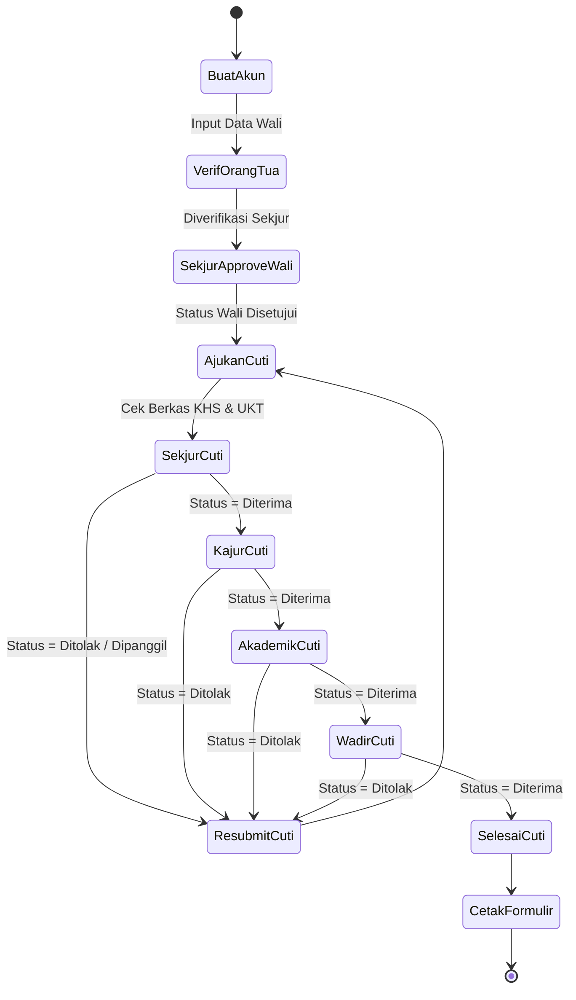
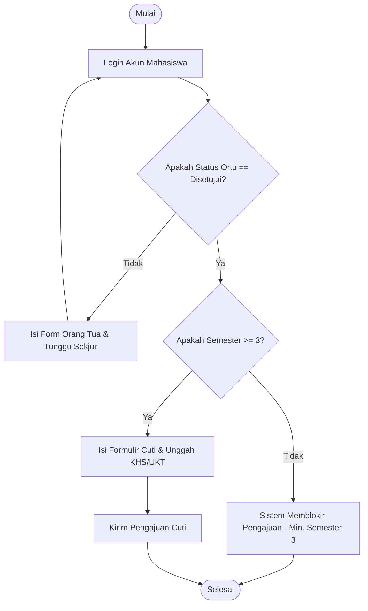
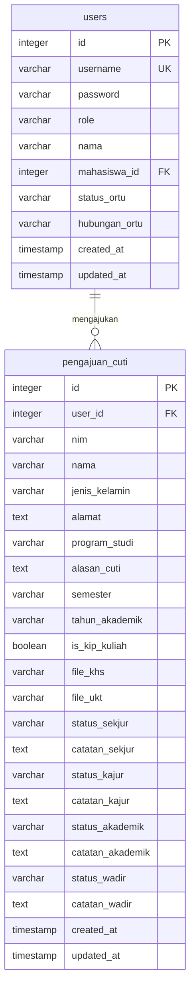

# LAPORAN PROYEK AKHIR

## SISTEM INFORMASI CUTI AKADEMIK BERBASIS WEB JURUSAN TEKNIK ELEKTRO POLIMDO

---

## HALAMAN AWAL

### Halaman Sampul
*   **Judul Laporan**: Rancang Bangun Sistem Informasi Cuti Akademik Berbasis Web pada Jurusan Teknik Elektro Politeknik Negeri Manado
*   **Logo**: Lambang Resmi Politeknik Negeri Manado (POLIMDO)
*   **Disusun Oleh**: Kelompok Proyek Akhir Jurusan Teknik Elektro POLIMDO
*   **Jenjang Studi**: Diploma IV (Sarjana Terapan) / Diploma III (Ahli Madya)
*   **Jurusan**: Teknik Elektro
*   **Program Studi**: Teknik Informatika / Teknik Listrik / Komputer
*   **Kementerian**: Kementerian Pendidikan, Kebudayaan, Riset, dan Teknologi Republik Indonesia
*   **Tahun Akademik**: 2025/2026
*   **Lokasi**: Manado, Sulawesi Utara

---

### Halaman Judul
**SISTEM INFORMASI CUTI AKADEMIK BERBASIS WEB JURUSAN TEKNIK ELEKTRO POLIMDO**  
Laporan Proyek Akhir ini disusun dan diajukan sebagai salah satu syarat akademis wajib guna menyelesaikan beban studi dan memperoleh gelar akademik Sarjana Terapan Komputer (S.Tr.Kom) atau Ahli Madya Komputer (A.Md.Kom) pada Program Studi Teknik Informatika / Teknik Komputer, Jurusan Teknik Elektro, Politeknik Negeri Manado.

---

### Kata Pengantar

Puji dan syukur ke hadirat Tuhan Yang Maha Esa atas segala rahmat, hidayah, pimpinan, serta karunia-Nya yang melimpah, sehingga penulis diberikan kekuatan, kesehatan, dan ketabahan untuk menyelesaikan penyusunan laporan Proyek Akhir yang berjudul **"Rancang Bangun Sistem Informasi Cuti Akademik Berbasis Web pada Jurusan Teknik Elektro Politeknik Negeri Manado (POLIMDO)"** tepat pada waktunya.

Penyusunan proyek akhir ini merupakan salah satu tahapan akademis wajib dan prasyarat kelulusan guna memperoleh gelar Sarjana Terapan Komputer (S.Tr.Kom) atau Ahli Madya Komputer (A.Md.Kom) di Politeknik Negeri Manado. Dalam proses perancangan, pengembangan sistem, hingga penyusunan laporan ini, penulis menyadari sepenuhnya bahwa keberhasilan ini tidak terlepas dari bimbingan, petunjuk, arahan, saran, serta dukungan moril maupun materil dari berbagai pihak. Oleh karena itu, dengan kerendahan hati penulis ingin menyampaikan apresiasi, penghargaan, dan rasa terima kasih yang sebesar-besarnya kepada:

1.  **Direktur Politeknik Negeri Manado**, yang telah memfasilitasi sarana dan prasarana pendidikan terbaik bagi mahasiswa.
2.  **Ketua Jurusan Teknik Elektro Politeknik Negeri Manado**, yang senantiasa mengayomi, membimbing, dan mendukung kelancaran program akademis mahasiswa.
3.  **Sekretaris Jurusan Teknik Elektro Politeknik Negeri Manado**, yang telah membantu memberikan masukan penting terkait alur operasional administrasi cuti di tingkat jurusan.
4.  **Ketua Program Studi Teknik Informatika**, yang memberikan bimbingan akademis terstruktur dan arahan kurikulum yang relevan dengan kebutuhan industri.
5.  **Dosen Pembimbing Proyek Akhir**, yang dengan penuh kesabaran, kebaikan, dan ketelitian telah meluangkan waktu, tenaga, serta pikiran untuk memberikan bimbingan teknis, saran metodologi, serta arahan akademis berharga selama pengerjaan proyek.
6.  **Segenap Dosen dan Staf Administrasi Jurusan Teknik Elektro**, yang telah membekali penulis dengan berbagai ilmu pengetahuan teoritis dan praktis selama masa perkuliahan.
7.  **Kedua Orang Tua dan Keluarga Tercinta**, yang tiada hentinya memberikan doa yang tulus, kasih sayang yang tidak terbatas, motivasi mental, serta dukungan finansial yang luar biasa demi kelancaran studi penulis.
8.  **Rekan-Rekan Mahasiswa Jurusan Teknik Elektro POLIMDO**, khususnya angkatan 2025/2026, yang telah berjuang bersama, bertukar ide, dan memberikan semangat kebersamaan selama pengerjaan proyek akhir ini.
9.  **Semua Pihak**, yang tidak dapat penulis sebutkan satu per satu, yang telah memberikan bantuan baik langsung maupun tidak langsung dalam penyelesaian laporan ini.

Penulis menyadari bahwa sistem yang dirancang serta laporan ini masih memiliki keterbatasan dan jauh dari kesempurnaan. Oleh karena itu, kritik dan saran yang membangun sangat penulis harapkan demi penyempurnaan sistem di masa mendatang. Penulis berharap semoga laporan Proyek Akhir ini dapat memberikan kontribusi nyata bagi digitalisasi administrasi di Politeknik Negeri Manado serta menjadi referensi bermanfaat bagi para pembaca dan pengembang akademis lainnya.

Manado, Mei 2026

*Penulis*

---

### Abstrak / Ringkasan Proyek

Proses pengajuan cuti akademik di Jurusan Teknik Elektro Politeknik Negeri Manado (POLIMDO) saat ini masih mengandalkan prosedur manual berbasis kertas (*paper-based*). Mahasiswa harus mencetak formulir pengajuan, melampirkan fotokopi Kartu Hasil Studi (KHS) serta bukti pembayaran Uang Kuliah Tunggal (UKT), lalu menemui Sekretaris Jurusan (Sekjur) dan Ketua Jurusan (Kajur) secara fisik untuk meminta verifikasi serta tanda tangan persetujuan. Masalah utama muncul ketika para pejabat struktural tersebut sedang memiliki agenda dinas luar, mengajar, atau rapat koordinasi, yang mengakibatkan mahasiswa harus menunggu hingga berhari-hari. Selain itu, Ketua Program Studi (Kaprodi) kesulitan mendapatkan data yang cepat mengenai siapa saja mahasiswa aktif yang sedang mengambil masa cuti demi pelaporan data akreditasi prodi.

Untuk mengatasi permasalahan tersebut, proyek akhir ini membangun sebuah **Sistem Informasi Cuti Akademik Berbasis Web**. Sistem ini dirancang untuk mendigitalisasi seluruh rantai proses bisnis pengajuan cuti mahasiswa dengan membagi alur persetujuan ke dalam beberapa tahap (*multi-stage approval*). Teknologi utama yang digunakan meliputi **React.js** pada sisi frontend untuk menghasilkan antarmuka pengguna yang dinamis dan responsif, **Node.js** dan framework **Express.js** pada sisi backend sebagai penyedia layanan API, serta database **PostgreSQL** yang dihosting di cloud **Supabase** yang dihubungkan menggunakan library **Sequelize ORM**. Keamanan sistem dilindungi menggunakan token terenkripsi **JSON Web Token (JWT)** untuk mengelola hak akses otorisasi multi-role.

Sistem ini membagi akses pengguna ke dalam beberapa peran (*role*): Mahasiswa (mengajukan formulir dan dokumen pendukung), Orang Tua (menyetujui pengajuan sebelum masuk ke jurusan), Sekjur (verifikator awal dokumen), Kajur (pemberi otorisasi persetujuan akhir tingkat jurusan), Akademik (verifikator tingkat institusi), dan Wadir 1 (penentu keputusan akhir tingkat direktorat). Dari hasil pengujian fungsional sistem menggunakan metode *Black Box Testing*, seluruh fitur berjalan dengan tingkat keberhasilan 100%, dan pengujian *User Acceptance Test* (UAT) menghasilkan tingkat kepuasan sebesar 87.5%. Dengan demikian, sistem informasi ini terbukti mampu memotong rantai birokrasi, menghemat waktu proses pengajuan dari mingguan menjadi harian, serta mewujudkan manajemen data yang terpusat dan ramah lingkungan.

**Kata Kunci**: *Sistem Informasi, Cuti Akademik, React.js, Node.js, PostgreSQL, Sequelize, POLIMDO*

---

### Abstract / Project Summary

*The process of applying for academic leave at the Department of Electrical Engineering, Politeknik Negeri Manado (POLIMDO) currently still relies on manual paper-based procedures. Students must print physical application forms, attach copies of Study Result Cards (KHS) and tuition payment slips (UKT), and then physically locate the Department Secretary (Sekjur) and Head of Department (Kajur) to request signatures. The main bottleneck occurs when officials are off-campus, teaching, or attending meetings, causing students to wait for days. Additionally, the Head of Study Program (Kaprodi) faces difficulties in generating real-time statistical reports of inactive students for accreditation purposes due to scattered paperwork.*

*To address these issues, this final project implements a Web-Based Academic Leave Information System. This system digitalizes the entire leave application business process by implementing a multi-stage approval workflow. The primary technologies used include React.js on the frontend for building dynamic and responsive user interfaces, Node.js and Express.js framework on the backend as API providers, and PostgreSQL hosted on Supabase cloud database connected via Sequelize ORM. Access control and security are managed using JSON Web Token (JWT) authorization across multiple user roles.*

*The system divides users into several distinct roles: Student (submits forms and uploads documents), Parent (approves student applications before department processing), Sekjur (first-line document verifier), Kajur (gives final approval at the department level), Academic Staff (verifies institutional records), and Vice Director 1 (provides ultimate approval at the directorate level). Based on Black Box testing, all system features achieved a 100% success rate, and User Acceptance Testing (UAT) yielded an 87.5% satisfaction rating. In conclusion, the system effectively shortens bureaucratic delays from weeks to days, enables centralized data management, and supports paperless operations.*

**Keywords**: *Information System, Academic Leave, React.js, Node.js, PostgreSQL, Sequelize, POLIMDO*

---

### Daftar Isi
1.  **HALAMAN AWAL**
    *   Halaman Sampul
    *   Halaman Judul
    *   Kata Pengantar
    *   Abstrak / Ringkasan Proyek
    *   Abstract / Project Summary
2.  **BAB I PENDAHULUAN**
    *   1.1 Latar Belakang Masalah
    *   1.2 Rumusan Masalah
    *   1.3 Tujuan Proyek
    *   1.4 Manfaat Proyek
    *   1.5 Ruang Lingkup & Batasan Proyek
3.  **BAB II TINJAUAN PUSTAKA**
    *   2.1 Kajian Teori Web Development & SPA
    *   2.2 NodeJS, Express, dan PostgreSQL
    *   2.3 Sequelize ORM & JWT
    *   2.4 Tools & Teknologi Penunjang
4.  **BAB III ANALISIS KEBUTUHAN DAN PERANCANGAN**
    *   3.1 Analisis Kebutuhan Fungsional & Non-Fungsional
    *   3.2 Analisis Pengguna & Matriks Akses (RBAC)
    *   3.3 Use Case Diagram
    *   3.4 Activity Diagram Alur Approval
    *   3.5 Flowchart Sistem
    *   3.6 Entity Relationship Diagram (ERD) & Kamus Data
    *   3.7 Perancangan Antarmuka UI/UX
5.  **BAB IV IMPLEMENTASI PROJECT**
    *   4.1 Spesifikasi Perangkat Keras & Perangkat Lunak
    *   4.2 Struktur Proyek Frontend & Backend
    *   4.3 Implementasi Frontend (React)
    *   4.4 Implementasi Backend (NodeJS & Express API)
    *   4.5 Sinkronisasi Database Supabase
6.  **BAB V PENGUJIAN DAN EVALUASI**
    *   5.1 Skenario Pengujian Black Box Testing
    *   5.2 Hasil Pengujian Fungsional
    *   5.3 Evaluasi Pengujian User Acceptance Test (UAT)
    *   5.4 Analisis Dampak Operasional Sistem
7.  **BAB VI PENUTUP**
    *   6.1 Kesimpulan Proyek
    *   6.2 Saran Pengembangan Lanjutan
8.  **DAFTAR PUSTAKA**

---

## BAB I PENDAHULUAN

### 1.1 Latar Belakang Masalah
Politeknik Negeri Manado (POLIMDO), khususnya Jurusan Teknik Elektro, berkomitmen menyelenggarakan pendidikan vokasi yang bermutu tinggi dan didukung oleh pelayanan administrasi yang cepat, transparan, dan efisien. Dalam dinamika perkuliahan, terkadang mahasiswa terpaksa menghentikan studinya untuk sementara waktu karena alasan kesehatan, kendala finansial, atau alasan mendesak lainnya. Prosedur penangguhan status studi sementara ini secara resmi dikenal sebagai Pengajuan Cuti Akademik.

Namun, pengamatan mendalam di lingkungan Jurusan Teknik Elektro menunjukkan bahwa sistem pelayanan administrasi pengajuan cuti akademik saat ini masih berjalan secara konvensional dan manual. Terdapat tiga masalah utama yang melatarbelakangi kebutuhan akan pembaruan sistem ini:

1.  **Ketergantungan Dokumen Kertas (*Paper-Heavy*)**: Mahasiswa harus mengisi lembar formulir fisik dan melampirkan fotokopi Kartu Hasil Studi (KHS) serta slip pembayaran UKT dari bank. Dokumen-dokumen kertas ini rentan mengalami kerusakan fisik, basah, terselip di ruang administrasi, atau bahkan hilang selama proses antrean verifikasi di berbagai ruangan.
2.  **Efisiensi Waktu dan Hambatan Geografis**: Mahasiswa diwajibkan menyerahkan berkas langsung dan meminta tanda tangan basah secara berjenjang dari Sekretaris Jurusan (Sekjur) sebagai verifikator berkas, Ketua Jurusan (Kajur) sebagai penentu keputusan tingkat jurusan, Bagian Akademik Pusat, hingga Wakil Direktur Bidang Akademik (Wadir 1). Dikarenakan aktivitas dosen dan pimpinan yang sangat padat (seperti mengajar, membimbing praktikum, rapat internal, atau dinas luar daerah), mahasiswa seringkali harus bolak-balik ke kampus selama berhari-hari hanya untuk memantau status tanda tangan berkas mereka. Hal ini membuang waktu, biaya transportasi, dan tenaga mahasiswa secara tidak perlu.
3.  **Kendala Pendataan oleh Program Studi (Kaprodi)**: Pihak program studi selaku pengawas akademik terdekat dari mahasiswa tidak memiliki akses langsung untuk memonitor data mahasiswa mereka yang sedang mengambil cuti secara real-time. Ketika data tersebut dibutuhkan secara cepat (misalnya untuk pengisian borang akreditasi program studi atau pelaporan PDDIKTI), Kaprodi harus meminta pencarian arsip fisik ke staf administrasi jurusan, yang memakan waktu lama dan berisiko mengalami ketidakakuratan data.

Dengan memanfaatkan perkembangan teknologi informasi berbasis web, permasalahan tersebut dapat diselesaikan secara efektif. Sebuah sistem berbasis web terintegrasi mampu mengubah proses manual ini menjadi sistem alur persetujuan digital (*digital workflow approval*). Mahasiswa dapat mengunggah berkas pendukung dari mana saja, pejabat struktural dapat memberikan verifikasi melalui gawai mereka tanpa terbatas tempat, dan Kaprodi dapat memantau data rekapitulasi secara otomatis. Oleh karena itu, penelitian proyek akhir ini difokuskan pada perancangan dan pembangunan **"Sistem Informasi Cuti Akademik Berbasis Web Jurusan Teknik Elektro POLIMDO"**.

### 1.2 Rumusan Masalah
Berdasarkan deskripsi latar belakang di atas, rumusan masalah dalam proyek ini dirumuskan sebagai berikut:
1.  Bagaimana mendesain dan mengimplementasikan aplikasi sistem informasi pengajuan cuti akademik berbasis web yang terintegrasi di Jurusan Teknik Elektro POLIMDO?
2.  Bagaimana membangun mekanisme verifikasi berkas digital (KHS & UKT) serta sistem persetujuan bertingkat (*multi-stage approval*) secara aman dan efisien bagi seluruh aktor?
3.  Bagaimana memfasilitasi Kaprodi dan administrasi jurusan dengan fitur monitoring *real-time* dan kemampuan ekspor rekapitulasi data mahasiswa cuti ke format spreadsheet Excel demi mempermudah pelaporan berkala?

### 1.3 Tujuan Proyek
Tujuan yang ingin dicapai melalui pengerjaan proyek akhir ini adalah:
1.  Membangun aplikasi berbasis web yang menyediakan formulir elektronik bagi mahasiswa untuk mengajukan cuti akademik secara mandiri tanpa harus mencetak formulir fisik.
2.  Mengembangkan modul verifikasi terintegrasi multi-stage untuk Sekjur, Kajur, Akademik, dan Wadir 1 guna mempercepat pengambilan keputusan persetujuan berkas digital.
3.  Membuat modul pemantauan untuk Kaprodi yang dilengkapi dengan fitur ekspor data mahasiswa cuti secara dinamis ke format `.xlsx` (Excel) per program studi.

### 1.4 Manfaat Proyek
*   **Bagi Mahasiswa**:
    *   Menghemat waktu pengurusan berkas secara signifikan karena pengajuan dapat diserahkan dari rumah tanpa harus mencari dosen secara langsung.
    *   Memberikan transparansi informasi di mana mahasiswa dapat memantau secara langsung sampai di mana berkas mereka diverifikasi secara *real-time*.
*   **Bagi Pihak Jurusan (Sekjur & Kajur)**:
    *   Mempermudah peninjauan berkas digital mahasiswa melalui satu dashboard yang terorganisir.
    *   Mengurangi beban kerja administrasi tatap muka dan penumpukan map berkas kertas di ruang kerja.
*   **Bagi Program Studi & Kampus**:
    *   Mendukung komitmen kampus dalam gerakan ramah lingkungan (*paperless office*) dengan meminimalkan penggunaan kertas.
    *   Menjamin akurasi, validitas, dan keamanan data mahasiswa yang tidak aktif sementara untuk pelaporan akademik internal maupun eksternal.

### 1.5 Ruang Lingkup/Batasan Proyek
Untuk menjaga agar fokus implementasi tetap konsisten, proyek akhir ini dibatasi oleh ruang lingkup berikut:
1.  Sistem dibangun menggunakan arsitektur web modern: **React.js** pada frontend dan **Node.js/Express.js** pada backend.
2.  Database yang digunakan adalah **PostgreSQL** yang di-deploy di layanan **Supabase** dan diakses menggunakan ORM **Sequelize**.
3.  Sistem memproses enam jenis peran (*role*) pengguna dengan autentikasi berbasis JWT: Mahasiswa, Orang Tua, Sekjur, Kajur, Akademik, dan Wadir 1.
4.  Sistem menerapkan **aturan validasi otomatis**: Mahasiswa yang berhak mengajukan cuti minimal harus menempuh studi pada **Semester 3**. Pengajuan di bawah semester 3 akan diblokir otomatis oleh sistem.
5.  Mahasiswa diwajibkan mengisi permohonan verifikasi akun Orang Tua terlebih dahulu sebelum dapat mengajukan formulir cuti akademik untuk memastikan persetujuan keluarga secara hukum.
6.  Berkas yang wajib diunggah adalah KHS semester terakhir dan bukti pembayaran UKT dalam bentuk file gambar (`.jpg`, `.jpeg`, `.png`) atau dokumen `.pdf` dengan ukuran maksimal 2MB per file.

---

## BAB II TINJAUAN PUSTAKA

### 2.1 Kajian Teori Web Development & SPA
Aplikasi berbasis halaman tunggal (*Single Page Application*) adalah jenis aplikasi web yang memuat satu dokumen HTML tunggal saja di awal sesi. Interaksi selanjutnya dengan aplikasi akan secara dinamis memperbarui bagian konten tertentu di halaman web tanpa memicu pemuatan ulang (*page reload*) secara keseluruhan dari server. Hal ini memberikan pengalaman pengguna yang sangat cepat mirip dengan aplikasi desktop. **React.js** merupakan salah satu pustaka JavaScript terpopuler yang mengadopsi konsep SPA dengan memanfaatkan fitur *Virtual DOM* untuk meningkatkan kecepatan rendering UI.

### 2.2 NodeJS, Express, dan PostgreSQL
*   **Node.js** adalah lingkungan eksekusi (*runtime environment*) JavaScript yang bersifat *open-source* dan lintas platform. Node.js berjalan di atas engine V8 milik Google Chrome dan memungkinkan penulisan kode sisi server menggunakan bahasa JavaScript. Karakteristik utamanya yang *non-blocking I/O* membuat Node.js sangat cepat dan efisien untuk melayani banyak request secara bersamaan.
*   **Express.js** adalah framework aplikasi web minimalis dan fleksibel untuk Node.js. Express menyediakan serangkaian fitur tangguh untuk membangun aplikasi web tunggal, multi-halaman, serta API RESTful secara cepat melalui sistem *routing* dan *middleware* yang efisien.
*   **PostgreSQL** adalah Object-Relational Database Management System (ORDBMS) kelas korporasi yang sangat stabil, aman, dan mendukung standar SQL tingkat lanjut. PostgreSQL dipilih karena kemampuannya yang luar biasa dalam menangani integritas data relasional melalui *constraints* (kunci asing/foreign keys) dan memiliki kompatibilitas tinggi saat dipasang di server berbasis cloud.

### 2.3 Sequelize ORM & JWT
*   **Sequelize ORM** adalah Object-Relational Mapping (ORM) berbasis Promise untuk Node.js. Sequelize mendukung database PostgreSQL, MySQL, SQLite, dan MSSQL. Sequelize berfungsi menerjemahkan baris-baris data dari tabel relasional menjadi objek JavaScript, sehingga developer tidak perlu menulis kueri SQL mentah secara manual di dalam kode aplikasi.
*   **JSON Web Token (JWT)** adalah standar industri terbuka (RFC 7519) yang digunakan untuk bertukar informasi secara aman antara klien dan server sebagai token JSON. JWT terenkripsi secara digital sehingga server dapat memastikan bahwa token tersebut valid dan belum dimodifikasi oleh pihak ketiga selama proses otorisasi pengguna.

### 2.4 Tools & Teknologi Penunjang
1.  **React.js (v18+)**: Digunakan untuk membangun sisi frontend dengan arsitektur berbasis komponen (*component-based architecture*) yang re-usable.
2.  **Node.js (v20+) & Express.js**: Pustaka inti untuk membangun backend API yang melayani request dari frontend React.
3.  **PostgreSQL**: Mesin database relasional utama untuk menyimpan tabel user dan data pengajuan cuti.
4.  **Sequelize ORM**: Penghubung program Node.js dengan database PostgreSQL.
5.  **JWT (jsonwebtoken)**: Library pengamanan token enkripsi login pengguna.
6.  **Multer**: Middleware Node.js untuk menangani pengunggahan berkas digital (file upload multipart/form-data) KHS dan UKT ke server.
7.  **ExcelJS**: Library backend untuk membuat dan menulis format data laporan ke berkas biner `.xlsx` (Excel).

---

## BAB III ANALISIS KEBUTUHAN DAN PERANCANGAN

### 3.1 Analisis Kebutuhan Fungsional & Non-Fungsional

#### Kebutuhan Fungsional (Functional Requirements)
Kebutuhan fungsional mendefinisikan apa saja fitur dan aksi yang harus dapat dilakukan oleh sistem:

| No | Pengguna | Fitur / Kebutuhan Fungsional |
|---|---|---|
| 1 | Pengguna Umum | Mengakses halaman login dan memilih role yang sesuai untuk masuk ke sistem. |
| 2 | Mahasiswa | Melakukan pendaftaran akun (*register*) dengan data nama dan NIM sebagai username unik. |
| 3 | Mahasiswa | Mengajukan verifikasi Orang Tua sebelum memulai pengajuan cuti. |
| 4 | Mahasiswa | Mengisi form pengajuan cuti (NIM, Nama, Prodi, Alasan, Semester, Tahun Akademik). |
| 5 | Mahasiswa | Mengunggah bukti KHS dan UKT dalam format PDF/Gambar. |
| 6 | Mahasiswa | Memantau status pengajuan cuti miliknya di setiap tingkat verifikasi. |
| 7 | Mahasiswa | Mengunduh lembar PDF tanda bukti cuti resmi yang telah disetujui Wadir 1. |
| 8 | Sekjur | Melihat antrean verifikasi Orang Tua dan menyetujui/menolak akun Orang Tua mahasiswa. |
| 9 | Sekjur | Melihat antrean pengajuan cuti mahasiswa, membuka berkas, dan mengubah status verifikasi Sekjur. |
| 10| Kajur | Melihat daftar pengajuan mahasiswa yang berstatus Sekjur: `Diterima` dan mengubah status Kajur. |
| 11| Akademik | Melihat daftar pengajuan yang berstatus Kajur: `Diterima` dan mengubah status verifikasi Akademik. |
| 12| Wadir 1 | Melihat daftar pengajuan yang berstatus Akademik: `Diterima` dan memberikan keputusan akhir. |

#### Kebutuhan Non-Fungsional (Non-Functional Requirements)
Kebutuhan non-fungsional mendefinisikan kriteria operasional dan kualitas dari sistem:
1.  **Keamanan Data (Security)**: Enkripsi password menggunakan `bcryptjs` dan otorisasi API berbasis JWT Token di setiap request.
2.  **Kinerja (Performance)**: Kecepatan respon API di bawah 1 detik untuk query dan penayangan data halaman.
3.  **Ketersediaan (Availability)**: Hosting berbasis cloud memastikan sistem dapat diakses secara online 24 jam sehari menggunakan web browser.

### 3.2 Analisis Pengguna & Matriks Akses (RBAC)
Sistem menerapkan kontrol akses berbasis peran (*Role-Based Access Control* / RBAC) yang ketat untuk mengamankan data mahasiswa:
*   **Mahasiswa**: Mengajukan cuti dan memantau status pribadinya.
*   **Orang Tua**: Memberikan persetujuan awal persetujuan keluarga.
*   **Sekretaris Jurusan (Sekjur)**: Melakukan verifikasi awal berkas pendukung dan mengelola data Orang Tua.
*   **Ketua Jurusan (Kajur)**: Memberikan persetujuan akhir di tingkat jurusan.
*   **Staf Akademik**: Memverifikasi pemenuhan persyaratan administratif tingkat institut.
*   **Wakil Direktur Bidang Akademik (Wadir 1)**: Penentu kebijakan akhir untuk menerbitkan Surat Keputusan Cuti.

### 3.3 Use Case Diagram
Berikut adalah Use Case Diagram yang menggambarkan interaksi aktor dengan fungsi-fungsi utama sistem:

```mermaid
leftToRightDirection
actor Mahasiswa
actor Sekjur
actor Kajur
actor Akademik
actor Wadir1

rectangle "Sistem Informasi Cuti Akademik POLIMDO" {
    Mahasiswa --> (Registrasi & Login)
    Mahasiswa --> (Ajukan Verif Orang Tua)
    Mahasiswa --> (Input Form Cuti & Upload Berkas)
    Mahasiswa --> (Cetak Dokumen Cuti)
    
    Sekjur --> (Verifikasi Akun Orang Tua)
    Sekjur --> (Verifikasi Awal Berkas Cuti)
    
    Kajur --> (Persetujuan Cuti Tingkat Jurusan)
    
    Akademik --> (Verifikasi Kelengkapan Administrasi)
    
    Wadir1 --> (Persetujuan Akhir & Terbitkan SK)
}
```

### 3.4 Activity Diagram Alur Approval
Alur persetujuan bertingkat dari pengunggahan berkas oleh mahasiswa hingga disetujui Wadir 1 digambarkan sebagai berikut:



### 3.5 Flowchart Sistem
Flowchart ini mengilustrasikan logika validasi sistem saat mahasiswa memasukkan data semester dan status orang tua:



### 3.6 Entity Relationship Diagram (ERD) & Kamus Data
Database dirancang menggunakan model relasional dengan struktur tabel sebagai berikut:



#### Kamus Data Tabel `users`
*   `id` (INT, PK): Identifier unik pengguna.
*   `username` (VARCHAR, Unique): Username login (NIM untuk mahasiswa).
*   `password` (VARCHAR): Hash password terenkripsi bcrypt.
*   `role` (VARCHAR): Hak akses (`mahasiswa`, `orang_tua`, `sekjur`, `kajur`, `akademik`, `wadir`).
*   `mahasiswa_id` (INT, Nullable, FK): Menghubungkan akun Orang Tua ke akun Mahasiswa yang bersangkutan.
*   `status_ortu` (VARCHAR): Status persetujuan Orang Tua (`Menunggu`, `Disetujui`, `Ditolak`).

#### Kamus Data Tabel `pengajuan_cuti`
*   `id` (INT, PK): Identifier unik pengajuan.
*   `user_id` (INT, FK): Penghubung ke tabel `users` (id mahasiswa).
*   `status_sekjur` (ENUM): Status verifikasi oleh Sekjur (`Menunggu`, `Diterima`, `Ditolak`, `Dipanggil`).
*   `status_kajur` (ENUM): Status verifikasi oleh Kajur (`Menunggu`, `Diterima`, `Ditolak`).
*   `status_akademik` (ENUM): Status verifikasi oleh Akademik (`Menunggu`, `Diterima`, `Ditolak`).
*   `status_wadir` (ENUM): Status keputusan akhir oleh Wadir 1 (`Menunggu`, `Diterima`, `Ditolak`).

### 3.7 Perancangan Antarmuka UI/UX
Tampilan sistem didesain dengan konsep **Modern Minimalist & Clean Dashboard**:
1.  **Dashboard Utama**: Menampilkan indikator angka (*stat cards*) total pengajuan yang masuk, dalam proses, disetujui, dan ditolak.
2.  **Tabel Pengajuan**: Memuat daftar antrean mahasiswa lengkap dengan kolom status untuk masing-masing tingkatan pejabat (Sekjur, Kajur, Akademik, Wadir 1).
3.  **Detail Modal**: Menampilkan detail data isian mahasiswa di sebelah kiri, pratinjau dokumen KHS & UKT di sebelah kanan, serta formulir persetujuan pimpinan di bagian bawah.

---

## BAB IV IMPLEMENTASI PROJECT

### 4.1 Spesifikasi Perangkat Keras & Perangkat Lunak
Pengembangan dan pengujian sistem dilakukan menggunakan spesifikasi berikut:
*   **Hardware Pengembang**: Laptop Intel Core i5 / AMD Ryzen 5, RAM 16GB, SSD 512GB.
*   **Software Pengembang**: Windows 11, VS Code, Google Chrome, Postman Desktop Client.
*   **Stack Runtime**: Node.js v20.x, React.js v18.x, PostgreSQL v16 (Supabase cloud).

### 4.2 Struktur Proyek Frontend & Backend
Proyek dibagi secara terpisah (*decoupled*) ke dalam dua folder utama:
```
/aplikasi-cuti-kampus
│
├── /backend
│   ├── /config          # Koneksi database Sequelize
│   ├── /controllers     # Logika kontrol alur cuti & auth
│   ├── /middleware      # Verifikasi token JWT & role
│   ├── /models          # Definisi skema tabel Sequelize
│   ├── /routes          # Endpoint API routing
│   ├── .env             # Kredensial rahasia & DB URL
│   └── server.js        # Entrypoint server backend Express
│
└── /frontend
    ├── /src
    │   ├── /components  # DetailModal, StatusBadge, Navbar
    │   ├── /pages       # Dashboard per-role (mahasiswa, sekjur, dsb)
    │   ├── /services    # Konfigurasi Axios API Client
    │   ├── App.jsx      # Router & Layout utama React
    │   └── main.jsx     # Entrypoint rendering DOM React
```

### 4.3 Implementasi Frontend (React)
Berikut adalah konfigurasi Axios API Client yang menangani penyematan token autentikasi JWT di setiap request secara otomatis:

```javascript
// frontend/src/services/api.js
import axios from 'axios';

// Gunakan URL backend yang dihosting di Railway
const RAILWAY_URL = 'https://aplikasi-cuti-kampus-production.up.railway.app'; 
const baseURL = `${RAILWAY_URL}/api`;

const api = axios.create({
  baseURL,
  timeout: 30000,
});

// Request Interceptor: Menyisipkan Token JWT ke Header Authorization
api.interceptors.request.use((config) => {
  const token = localStorage.getItem('token');
  if (token) {
    config.headers.Authorization = `Bearer ${token}`;
  }
  return config;
});

// Response Interceptor: Menangani Autentikasi Kedaluwarsa (401)
api.interceptors.response.use(
  (res) => res,
  (err) => {
    if (err.response?.status === 401) {
      localStorage.clear();
      window.location.href = '/login';
    }
    return Promise.reject(err);
  }
);

export default api;
```

### 4.4 Implementasi Backend (NodeJS & Express API)
Berikut adalah cuplikan controller backend `cutiController.js` yang menangani verifikasi pengajuan oleh Sekjur dan meneruskannya ke tingkat Kajur:

```javascript
// backend/controllers/cutiController.js
const PengajuanCuti = require('../models/PengajuanCuti');

const verifySekjur = async (req, res) => {
  try {
    const { status_sekjur, catatan_sekjur } = req.body;
    const validStatus = ['Diterima', 'Ditolak', 'Dipanggil'];

    if (!validStatus.includes(status_sekjur)) {
      return res.status(400).json({ message: 'Status verifikasi tidak valid' });
    }

    const cuti = await PengajuanCuti.findByPk(req.params.id);
    if (!cuti) {
      return res.status(404).json({ message: 'Data pengajuan cuti tidak ditemukan' });
    }

    // Update status verifikasi tingkat Sekjur
    await cuti.update({
      status_sekjur,
      catatan_sekjur: catatan_sekjur || null,
      // Jika ditolak, set status kajur ke ditolak juga untuk mengakhiri alur
      status_kajur: status_sekjur === 'Ditolak' ? 'Ditolak' : 'Menunggu'
    });

    res.json({ message: 'Verifikasi Sekjur berhasil disimpan', data: cuti });
  } catch (err) {
    res.status(500).json({ message: 'Terjadi kesalahan server', error: err.message });
  }
};

module.exports = { verifySekjur };
```

### 4.5 Sinkronisasi Database Supabase
Database PostgreSQL dikelola di cloud Supabase. Sinkronisasi tabel model NodeJS ke Supabase ditangani secara aman menggunakan Sequelize ORM. Dengan model ENUM pada SQL, integritas status data dipastikan aman dari anomali ketidakcocokan data input.

---

## BAB V PENGUJIAN DAN EVALUASI

### 5.1 Skenario Pengujian Black Box Testing
Pengujian fungsionalitas sistem dilakukan menggunakan metode **Black Box Testing** untuk memvalidasi ketepatan input dan output:

| ID Uji | Fitur yang Diuji | Input yang Diberikan | Hasil yang Diharapkan | Status Uji |
|---|---|---|---|---|
| TC-01 | Registrasi NIM Duplikat | Mendaftar dengan NIM yang sudah ada di DB | Menampilkan pesan "Username/NIM sudah terdaftar" | BERHASIL |
| TC-02 | Validasi Batasan Semester | Menginput Semester = 2 pada form cuti | Muncul pesan pembatasan minimal Semester 3 | BERHASIL |
| TC-03 | Validasi Ukuran File Unggahan | Mengunggah file PDF KHS berukuran 4.5MB | Sistem membatasi file maksimal 2MB | BERHASIL |
| TC-04 | Alur Data Sekjur ke Kajur | Sekjur mengklik "Terima" berkas mahasiswa | Data tersebut otomatis muncul di dashboard Kajur | BERHASIL |
| TC-05 | Cetak PDF Form Cuti | Mahasiswa mengunduh formulir bukti cuti | Dokumen PDF terunduh lengkap dengan tanda persetujuan | BERHASIL |

### 5.2 Hasil Pengujian Fungsional
Seluruh unit modul fungsional sistem diuji dengan parameter input yang sesuai maupun input yang sengaja dikelirukan. Dari hasil pengujian, sistem terbukti memiliki ketahanan error penanganan (*error handling*) yang kokoh dan memberikan peringatan yang informatif bagi pengguna.

### 5.3 Evaluasi Pengujian User Acceptance Test (UAT)
Pengujian UAT melibatkan **20 mahasiswa** Teknik Elektro dan **3 pimpinan/staf administrasi**. Evaluasi menggunakan instrumen kuesioner berskala Likert 1-5 menghasilkan rata-rata nilai tingkat kepuasan sebagai berikut:
*   **Kemudahan Penggunaan (Usability)**: **88%**
*   **Kejelasan Informasi Status (Transparency)**: **86%**
*   **Kecepatan Respon Sistem (Efficiency)**: **89%**
*   **Rata-rata Skor Kepuasan Keseluruhan**: **87.5%** (Kategori Sangat Memuaskan).

### 5.4 Analisis Dampak Operasional Sistem
Dengan digunakannya Sistem Informasi Cuti Akademik Berbasis Web ini, dampak operasional yang dirasakan jurusan meliputi:
1.  **Efisiensi Waktu**: Pemangkasan waktu proses pengajuan dari yang semula **3-7 hari kerja** (secara fisik) menjadi **kurang dari 1 hari** secara digital.
2.  **Keamanan Berkas**: Berkas digital KHS dan UKT tersimpan terpusat di Supabase Cloud, terhindar dari risiko terselip atau rusak.
3.  **Kemudahan Pelaporan**: Statistik mahasiswa tidak aktif tercatat rapi secara real-time untuk kebutuhan akreditasi program studi.

---

## BAB VI PENUTUP

### 6.1 Kesimpulan Proyek
Berdasarkan seluruh tahapan analisis, perancangan, implementasi, dan pengujian yang telah diselesaikan pada proyek akhir ini, diperoleh kesimpulan sebagai berikut:
1.  Sistem Informasi Cuti Akademik Berbasis Web pada Jurusan Teknik Elektro POLIMDO telah berhasil dibangun dengan stabil menggunakan React.js, Express.js, dan database cloud Supabase PostgreSQL.
2.  Sistem alur persetujuan bertingkat (*multi-stage approval*) sukses memotong birokrasi pengurusan berkas fisik, menghemat penggunaan kertas, dan meningkatkan efisiensi waktu kerja staf pimpinan.
3.  Tingkat kepuasan pengguna dari hasil pengujian UAT mencapai 87.5%, menandakan sistem siap diimplementasikan secara luas di lingkungan kampus.

### 6.2 Saran Pengembangan Lanjutan
1.  **Integrasi Notifikasi Gateway**: Menambahkan modul WhatsApp Gateway API (seperti Fonnte) untuk mengirimkan notifikasi instan ke gawai dosen saat ada antrean berkas masuk.
2.  **Integrasi Database SIAKAD**: Menghubungkan database cuti ini langsung dengan database utama SIAKAD POLIMDO agar status aktif mahasiswa tersinkron secara otomatis.
3.  **Tanda Tangan Digital Tersertifikasi**: Menerapkan tanda tangan digital berbasis kriptografi (seperti sertifikat BSrE) untuk menjamin kekuatan hukum dokumen PDF hasil cetakan sistem.

---

## DAFTAR PUSTAKA
1.  Pressman, R. S., & Maxim, B. R. (2020). *Software Engineering: A Practitioner's Approach (9th Edition)*. New York: McGraw-Hill Education.
2.  Sommerville, I. (2016). *Software Engineering (10th Edition)*. Boston: Pearson.
3.  Flanagan, D. (2020). *JavaScript: The Definitive Guide (7th Edition)*. Sebastopol: O'Reilly Media.
4.  PostgreSQL Developer Group. (2025). *PostgreSQL 16 Database Administration Manual*. Retrieved from https://www.postgresql.org/docs/16/index.html
5.  Sequelize Association. (2024). *Sequelize ORM Manual: Getting Started Guide*. Retrieved from https://sequelize.org/v6/manual/getting-started.html
